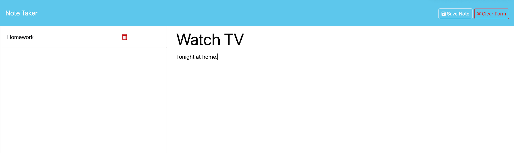

# Note Taker

## Description

This project was created to help small business owners organize and keep track of tasks they need to complete.

## Usage

Navigate to this [website](https://secret-forest-79904-c82eb644232c.herokuapp.com/). Press the "Get Started" button to input new notes. A list of saved notes will be displayed on the left-hand side, and they can be deleted by pressing the red "x" button. New notes can be saved by inputing text into "Note Title" and "Note Text". A "Clear Form" button will appear when inputting text to clear input fields. Then a "Save Form" button will appear to save the new note, which again will appear on the left-hand side. User may select any saved note on the left to display it in the center of the screen with "Note Text" displayed. Now there will be a "New Note" button on the top right, which will allow user to create a new note.